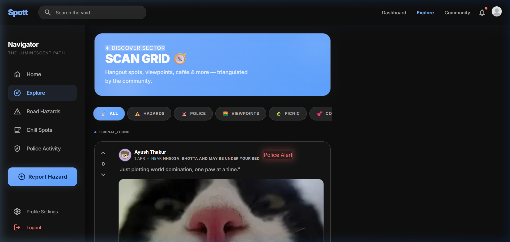

<p align="center">
  
</p>

<h1 align="center">🛰️ S P O T T</h1>

<p align="center">
  <strong>Real-Time Road Alerts & Community Hangout Finder</strong>
</p>

<p align="center">
  <em>"The Luminescent Navigator" — A community-driven intelligence grid for discovering <br/>
  safe hangout spots, road hazards, and police activity in real-time.</em>
</p>

<p align="center">
  
  
  
  
</p>

<p align="center">
  <a href="https://spott-dusky.vercel.app">🌐 Live Demo</a> · 
  <a href="#-features">✨ Features</a> · 
  <a href="#-getting-started">🚀 Setup</a> · 
  <a href="#-api-reference">📡 API</a> · 
  <a href="#-tech-stack">⚙️ Stack</a>
</p>

---

## 📸 Screenshots

<p align="center">
  
  <br/><sub><b>Home — Interactive Map HUD</b> with CartoDB Dark Matter tiles, live signal markers, and nearby alerts panel</sub>
</p>

<p align="center">
  
  <br/><sub><b>Explore — Signal Feed</b> with category filtering, voting, comments, and community moderation</sub>
</p>

<p align="center">
  
  <br/><sub><b>Authentication</b> with glassmorphic panels and the HUD-style form design</sub>
</p>

<p align="center">
  
  <br/><sub><b>Agent Profile</b> with trust score, rank badges, avatar customization, and signal history</sub>
</p>

---

## ✨ Features

### 🗺️ Interactive Map Intelligence
- **Dark-themed CartoDB map** with real-time signal markers
- **Geolocation-aware feed** — auto-sorts posts by proximity (15km radius)
- **Color-coded beacons** — Red (enforcement/accidents), Orange (hazards), Green (hangout spots)
- **Pulsing alert animations** for high-priority signals
- **Google Maps navigation** — one-tap directions to any spot

### 📡 Community Signal System
- **7 signal categories** — Police Alert, Accident, Viewpoint, Picnic, Couple Safe, Café, Random
- **Reddit-style voting** — upvote/downvote with visual state tracking
- **Threaded comments** — real-time discussions on each signal
- **Image uploads** — powered by Cloudinary CDN for fast global delivery
- **Reverse geocoding** — automatic location names via OpenStreetMap Nominatim

### 🛡️ Trust & Reputation
- **Trust Score** — calculated from community votes on your signals
- **Rank Badges** — earn titles from 🌱 New Signal → 📍 Local Spotter → ✅ Verified Guide → 🏆 Legend Scout
- **Community moderation** — report system auto-hides posts with 5+ reports
- **Post ownership controls** — only signal creators can delete their own posts

### 🔐 Authentication & Security
- **JWT-based auth** — secure token authentication with auto-expiry
- **Encrypted passwords** — bcrypt hashing with salt rounds
- **Protected routes** — middleware guards on all write operations
- **Session persistence** — localStorage token sync across tabs

### 🎨 Premium HUD Design System
- **"Luminescent Navigator"** design language with 48 custom CSS tokens
- **Glassmorphic panels** — frosted glass surfaces with backdrop-blur
- **Specular edges** — hair-thin white borders for depth separation
- **Material Symbols** icon library with variable font settings
- **Micro-animations** — fade-in, slide-up, pop-in, and pulse effects
- **Full responsive design** — desktop sidebar + mobile bottom nav

---

## ⚙️ Tech Stack

| Layer | Technology | Purpose |
|:---:|:---|:---|
| **Frontend** | React 19, Vite 8, Tailwind CSS 4 | SPA framework & build tool |
| **Routing** | React Router DOM 7 | Client-side navigation |
| **Maps** | Leaflet.js + React-Leaflet 5 | Interactive geospatial rendering |
| **Icons** | Lucide React + Material Symbols | Dual icon systems |
| **HTTP** | Axios | API client with interceptors |
| **Backend** | Node.js, Express 5 | REST API server |
| **Database** | MongoDB + Mongoose 9 | Document store with geospatial indexes |
| **Auth** | JWT + bcrypt | Token auth & password hashing |
| **Media** | Cloudinary + Multer | Image upload, storage & CDN |
| **Hosting** | Render (API) + Vercel (Frontend) | Full-stack cloud deployment |

---

## 🏗️ Project Structure

```
Spott/
├── frontend/                    # React SPA
│   ├── public/                  # Static assets
│   ├── src/
│   │   ├── assets/              # Logo and images
│   │   ├── components/
│   │   │   ├── Navbar.jsx       # Top navigation with user menu
│   │   │   ├── Sidebar.jsx      # Desktop navigation panel
│   │   │   ├── BottomNav.jsx    # Mobile tab bar
│   │   │   ├── PostCard.jsx     # Signal card with voting/comments
│   │   │   ├── CreatePostModal.jsx  # New signal form
│   │   │   ├── MapPreview.jsx   # Leaflet dark map component
│   │   │   └── CustomAlert.jsx  # Toast notification system
│   │   ├── context/
│   │   │   └── AuthContext.jsx  # Global auth state provider
│   │   ├── pages/
│   │   │   ├── Home.jsx         # Map dashboard + alerts panel
│   │   │   ├── Explore.jsx      # Filtered signal feed
│   │   │   ├── Profile.jsx      # User profile + signal history
│   │   │   ├── Login.jsx        # Authentication form
│   │   │   └── Register.jsx     # Registration form
│   │   ├── services/
│   │   │   └── api.js           # Axios instance with auth headers
│   │   ├── App.jsx              # Root layout + routing
│   │   └── index.css            # Design tokens + global styles
│   ├── index.html
│   ├── vite.config.js
│   └── package.json
│
├── server/                      # Express API
│   ├── config/
│   │   ├── db.js                # MongoDB connection
│   │   └── cloudinary.js        # Cloudinary + Multer config
│   ├── controllers/
│   │   ├── authController.js    # Register, Login, GetMe
│   │   ├── postController.js    # CRUD + Vote + Comment + Report
│   │   └── userController.js    # Profile, SavePost, UpdateAvatar
│   ├── middleware/
│   │   └── authMiddleware.js    # JWT verification guard
│   ├── models/
│   │   ├── Post.js              # Post schema with geospatial index
│   │   └── User.js              # User schema with savedPosts
│   ├── routes/
│   │   ├── authRoutes.js        # /api/auth/*
│   │   ├── postRoutes.js        # /api/posts/*
│   │   └── userRoutes.js        # /api/users/*
│   ├── server.js                # Express entry point
│   └── package.json
│
├── docs/screenshots/            # App screenshots
└── README.md                    # ← You are here
```

---

## 🚀 Getting Started

### Prerequisites

- **Node.js** ≥ 18.x
- **MongoDB** (Atlas cloud or local instance)
- **Cloudinary** account (free tier works)

### 1. Clone the Repository

```bash
git clone https://github.com/ayushthakur4/Spott.git
cd Spott
```

### 2. Setup the Backend

```bash
cd server
npm install
```

Create a `.env` file in the `server/` directory:

```env
PORT=5000
MONGO_URI=mongodb+srv://<username>:<password>@cluster.mongodb.net/spott
JWT_SECRET=your_super_secret_key_here
CLOUDINARY_CLOUD_NAME=your_cloud_name
CLOUDINARY_API_KEY=your_api_key
CLOUDINARY_API_SECRET=your_api_secret
NODE_ENV=development
```

Start the backend:

```bash
npm run dev        # Development (with hot reload)
npm start          # Production
```

### 3. Setup the Frontend

```bash
cd ../frontend
npm install
```

Optionally create a `.env` file in `frontend/` to point to a local backend:

```env
VITE_API_URL=http://localhost:5000/api
```

> If no `.env` is provided, the app defaults to the production API at `https://spott.onrender.com/api`

Start the frontend:

```bash
npm run dev
```

Open [http://localhost:5174](http://localhost:5174) in your browser.

---

## 📡 API Reference

### Authentication

| Method | Endpoint | Description | Auth |
|:---:|:---|:---|:---:|
| `POST` | `/api/auth/register` | Register a new user | ❌ |
| `POST` | `/api/auth/login` | Login with credentials | ❌ |
| `GET` | `/api/auth/me` | Get current user | ✅ |

### Posts (Signals)

| Method | Endpoint | Description | Auth |
|:---:|:---|:---|:---:|
| `GET` | `/api/posts` | Get all posts (supports `?lat=&lng=` for geo) | ❌ |
| `POST` | `/api/posts` | Create a new signal (multipart/form-data) | ✅ |
| `PUT` | `/api/posts/:id/upvote` | Toggle upvote | ✅ |
| `PUT` | `/api/posts/:id/downvote` | Toggle downvote | ✅ |
| `POST` | `/api/posts/:id/comments` | Add a comment | ✅ |
| `DELETE` | `/api/posts/:id` | Delete a signal (owner only) | ✅ |
| `POST` | `/api/posts/:id/report` | Report a signal | ✅ |

### Users

| Method | Endpoint | Description | Auth |
|:---:|:---|:---|:---:|
| `GET` | `/api/users/profile/:id` | Get user profile + posts + trust score | ❌ |
| `POST` | `/api/users/save/:postId` | Toggle bookmark a signal | ✅ |
| `PUT` | `/api/users/profile` | Update profile avatar | ✅ |

---

## 🌐 Deployment

### Backend — Render

The API is deployed on **Render** as a Web Service:

- **URL**: `https://spott.onrender.com`
- **Build Command**: `cd server && npm install`
- **Start Command**: `cd server && npm start`

Set the following environment variables in the Render dashboard:
- `MONGO_URI`, `JWT_SECRET`, `CLOUDINARY_CLOUD_NAME`, `CLOUDINARY_API_KEY`, `CLOUDINARY_API_SECRET`, `NODE_ENV=production`

### Frontend — Vercel

The frontend is deployed on **Vercel**:

- **URL**: `https://spott-dusky.vercel.app`
- **Framework Preset**: Vite
- **Root Directory**: `frontend`
- **Build Command**: `npm run build`
- **Output Directory**: `dist`

---

## 🎨 Design System — "The Luminescent Navigator"

Spott uses a carefully crafted **HUD-style dark mode** design system with 48 custom CSS design tokens.

| Token | Value | Usage |
|:---|:---|:---|
| `--color-primary` | `#7aafff` | Buttons, links, active states |
| `--color-secondary` | `#fe9400` | Hazard warnings, trust badges |
| `--color-tertiary` | `#b8ffb9` | Success states, chill spots |
| `--color-error` | `#ff716c` | Errors, police alerts, delete actions |
| `--color-background` | `#0e0e0e` | App background |
| `--color-surface` | `#0e0e0e` | Card surfaces |
| `--color-on-surface` | `#ffffff` | Primary text |

### Typography
- **Font**: Inter (Body, Headings, Labels)
- **Display**: Inter with `-0.02em` letter-spacing
- **Labels**: Uppercase, `0.05em` tracking

### Effects
- `glass-panel` — `rgba(14,14,14,0.60)` background with `blur(40px)`
- `ghost-border` — `1px solid var(--color-outline-variant)`
- `specular-edge` — `0.5px solid rgba(255,255,255,0.1)` top border
- `glow-primary` — `60px` box-shadow with primary color

---

## 🔮 Roadmap

- [ ] **Real-time WebSocket** updates for live signal streaming
- [ ] **Dark/Light mode** toggle with full token switching
- [ ] **Signal expiry** — auto-archive signals after 24 hours
- [ ] **Photo carousel** — multiple images per signal
- [ ] **Push notifications** — alert nearby users of new signals
- [ ] **Heatmap overlay** — density visualization of signal clusters
- [ ] **PWA support** — install as a native-like app on mobile
- [ ] **Admin dashboard** — moderation panel for reported signals

---

## 🤝 Contributing

Contributions are welcome! Here's how:

1. **Fork** the repository
2. **Create** your feature branch: `git checkout -b feature/amazing-feature`
3. **Commit** your changes: `git commit -m 'Add amazing feature'`
4. **Push** to the branch: `git push origin feature/amazing-feature`
5. Open a **Pull Request**

---

## 📄 License

This project is licensed under the **MIT License** — see the [LICENSE](LICENSE) file for details.

---

<p align="center">
  <br/>
  <strong>Built with 💙 by <a href="https://github.com/ayushthakur4">Ayush Thakur</a></strong>
  <br/><br/>
  <em>🛰️ "Transmit your first spot to the grid."</em>
  <br/><br/>
  
  
  
</p>
